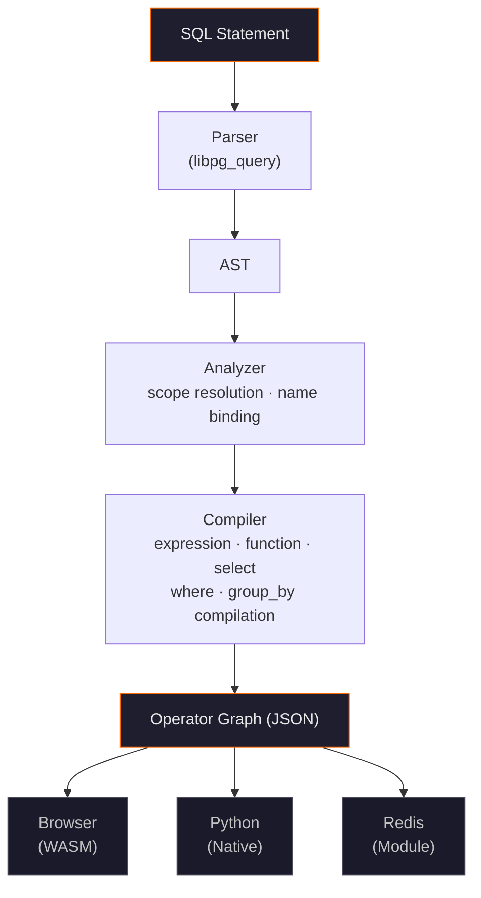

# RtBot SQL Overview

RtBot SQL is a SQL compiler that turns queries into streaming operator graphs. You write standard SQL with streaming extensions, and the compiler produces a deterministic program that processes data one message at a time.

## Architecture

The compiler has five internal stages:

1. **Parser** — uses libpg_query (the same parser as PostgreSQL) to produce an AST from SQL text
2. **Analyzer** — resolves names, binds column references to stream schemas, validates scope
3. **Expression compiler** — translates SQL expressions (arithmetic, comparisons, function calls) into operator subgraphs
4. **Function compiler** — maps SQL functions (MOVING_AVERAGE, MOVING_STD, FIR, etc.) to RtBot operators
5. **Graph builder** — assembles the operators and connections into a complete program

The output is a `CompilationResult` containing:

- **`program_json`** — the RtBot operator graph as JSON, ready to execute on any backend
- **`field_map`** — maps output column names to positions (e.g., `{"price": 0, "ma": 1}`)
- **`source_streams`** — which input streams the program reads from
- **`view_type`** — SCALAR, KEYED, or TOPK
- **`statement_type`** — what kind of SQL was compiled
- **`errors`** — compilation errors, if any

## What RtBot SQL is not

RtBot SQL is a purpose-built language for streaming numerical computation. It intentionally omits standard SQL features that don't have meaningful streaming semantics.

- **No string or text types.** All values are IEEE 754 double-precision floats. Text data must be encoded numerically upstream (e.g., category IDs, enum values).
- **No subqueries or CTEs.** Queries cannot nest SELECT statements or use WITH clauses. Compose pipelines by creating multiple views instead.
- **No window functions in the SQL:2003 sense.** There is no OVER or PARTITION BY syntax. RtBot provides its own streaming functions (MOVING_AVERAGE, MOVING_STD, FIR, etc.) that maintain state incrementally.
- **No DISTINCT.** Deduplication has no bounded-memory streaming implementation for arbitrary data.
- **No stream-to-stream JOIN.** Use multi-source FROM with automatic time alignment instead.
- **COUNT only supports COUNT(\*).** COUNT(expr) with null filtering is not supported.
- **ORDER BY requires LIMIT.** Sorting an unbounded stream is not meaningful without a finite result set.

These constraints keep the language small, deterministic, and fast. Every valid program compiles to a bounded-memory operator graph that processes each message in constant time.

## The catalog

The catalog is the schema registry. It tracks all streams, views, and tables you've created, along with their schemas and dependencies.

When you compile a SQL statement, the compiler looks up column names and types in the catalog. When you create a view that references another view, the catalog tracks that dependency for automatic propagation.

The catalog is maintained per-session. In Python, the `RtBotSql` instance holds the catalog. In the Playground, the browser session holds it.

## Three backends

The operator graph produced by the compiler runs on three backends:

| Backend | Runtime | Best for |
|---------|---------|----------|
| **Browser** | WebAssembly | Prototyping, live dashboards, interactive demos |
| **Python** | Native C++ extension | Notebooks, backtesting, data exploration |
| **Redis** | Redis module | Production deployment, persistent state, scaling |

All three execute the same operator graph with identical semantics. A program validated in Python produces the same output in Redis.

## SQL dialect

RtBot SQL uses PostgreSQL-compatible syntax via libpg_query. It supports:

- Standard `CREATE TABLE`, `CREATE VIEW`, `CREATE MATERIALIZED VIEW`
- `INSERT INTO ... VALUES`
- `SELECT` with `WHERE`, `GROUP BY`, `HAVING`, `LIMIT`
- `DROP` and `DELETE`

It extends standard SQL with streaming-specific features:

- `CREATE STREAM` — declares an input data source
- Windowed aggregate functions — `MOVING_AVERAGE(expr, N)`, `MOVING_STD(expr, N)`, etc.
- DSP functions — `FIR()`, `IIR()`, `RESAMPLE()`, `PEAK_DETECT()`
- `SUBSCRIBE` — streaming output subscription
- Multi-source `FROM` — automatic time-aligned joins across streams

See [Statements](/docs/reference/rtbot-sql/statements), [Clauses](/docs/reference/rtbot-sql/clauses), and [Functions](/docs/reference/rtbot-sql/functions) for the complete reference.
